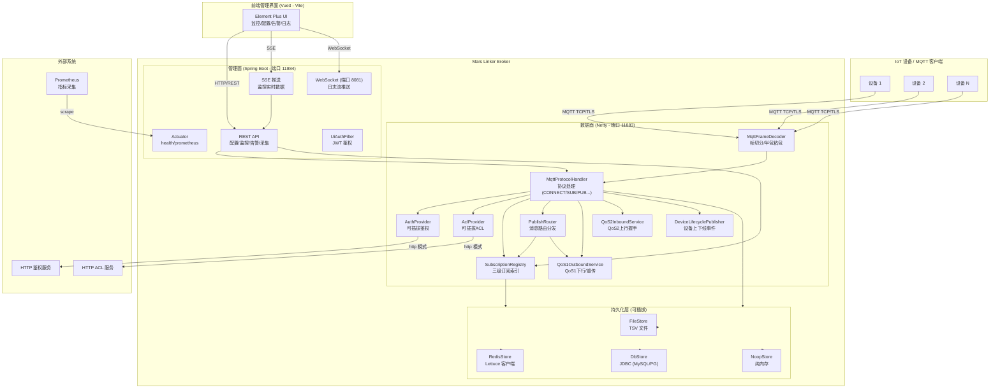
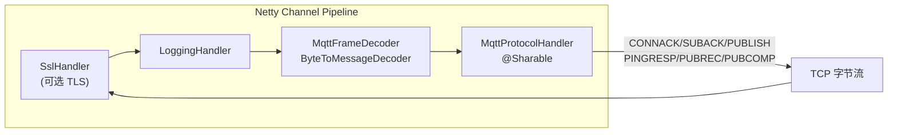
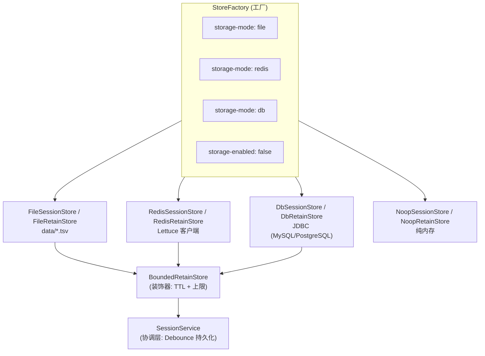
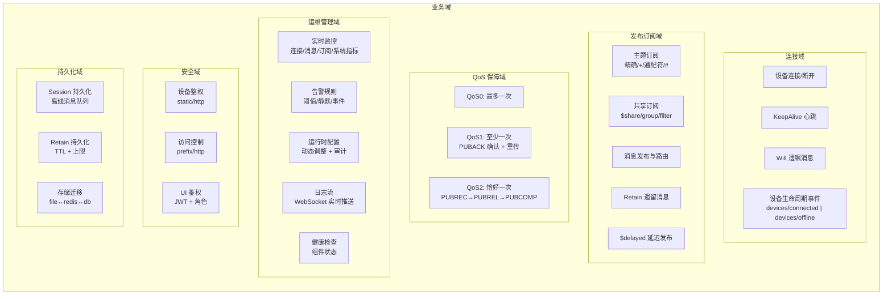
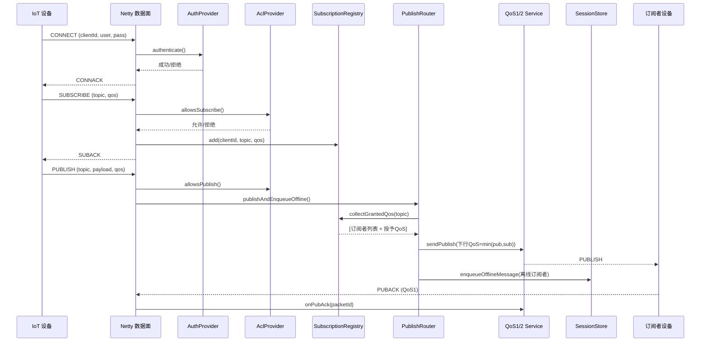
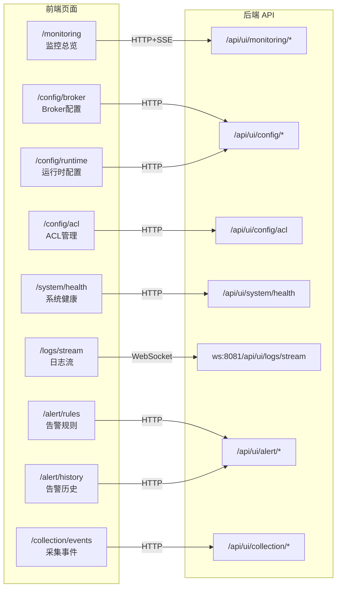

# Mars Linker

**Mars Linker** 是一个高性能、自研的 MQTT 3.1.1 Broker，采用 **Spring Boot + Netty** 双面架构——数据面（Netty MQTT TCP）专注协议转发，管理面（Spring Boot HTTP）提供运维监控、配置管理、告警与日志流等能力。配套 Vue3 运维管理界面，形成完整的 IoT 消息中间件解决方案。

---

## 目录

- [技术架构图](#技术架构图)
- [业务架构图](#业务架构图)
- [项目结构](#项目结构)
- [技术栈](#技术栈)
- [核心能力](#核心能力)
- [快速开始](#快速开始)
- [配置说明](#配置说明)
- [API 接口](#api-接口)
- [持久化配置](#持久化配置)
- [鉴权与 ACL](#鉴权与-acl)
- [监控与告警](#监控与告警)
- [压测指南](#压测指南)
- [端口汇总](#端口汇总)
- [生产推荐配置](#生产推荐配置)
- [设计文档](#设计文档)

---

## 技术架构图

### 整体架构



### Netty 数据面管道



### 持久化架构



---

## 业务架构图

### 业务域划分



### 消息流转



### 前端页面与后端 API 映射



---

## 项目结构

```
Mars_Linker/
├── pom.xml                              # Maven 父 POM（聚合模块）
├── mars-linker-broker/                  # [核心] MQTT Broker 后端
│   ├── pom.xml
│   └── src/main/java/com/mars/linker/broker/
│       ├── MarsLinkerApplication.java               # Spring Boot 启动入口
│       ├── config/                                  # 配置属性绑定
│       │   ├── MarsLinkerMqttBrokerConfiguration.java
│       │   └── MarsLinkerMqttBrokerProperties.java
│       ├── netty/                                   # 数据面 - Netty MQTT
│       │   ├── NettyMqttBrokerServer.java           # Netty TCP 服务器
│       │   ├── MqttFrameDecoder.java                # MQTT 帧切分解码器
│       │   ├── MqttProtocolHandler.java             # MQTT 协议处理器（核心 ~1500行）
│       │   ├── MqttTcpChannelInitializer.java       # Channel 管道初始化
│       │   ├── ClientSessionContext.java            # 连接级会话属性
│       │   ├── acl/                                 # ACL 访问控制
│       │   │   ├── AclProvider.java                 # ACL 接口
│       │   │   ├── PrefixAclProvider.java           # 主题前缀策略
│       │   │   └── HttpAclProvider.java             # HTTP 动态 ACL
│       │   ├── auth/                                # 设备鉴权
│       │   │   ├── AuthProvider.java                # 鉴权接口
│       │   │   ├── StaticAuthProvider.java          # 静态账号鉴权
│       │   │   └── HttpAuthProvider.java            # HTTP 回调鉴权
│       │   ├── metrics/                             # Micrometer 指标绑定
│       │   ├── protocol/                            # 协议逻辑
│       │   │   ├── SubscriptionRegistry.java        # 三级订阅索引
│       │   │   ├── PublishRouter.java               # 消息路由分发
│       │   │   ├── QoS1OutboundService.java         # QoS1 下行+重传
│       │   │   ├── QoS2InboundService.java          # QoS2 上行握手
│       │   │   ├── DeviceLifecyclePublisher.java    # 设备上下线事件
│       │   │   └── TopicFilterSupport.java          # 主题过滤匹配
│       │   └── store/                               # 持久化存储
│       │       ├── SessionStore.java / RetainStore.java
│       │       ├── FileSessionStore.java / FileRetainStore.java
│       │       ├── RedisSessionStore.java / RedisRetainStore.java
│       │       ├── DbSessionStore.java / DbRetainStore.java
│       │       ├── SessionService.java              # 会话协调层
│       │       ├── BoundedRetainStore.java          # Retain 限界装饰器
│       │       └── StoreFactory.java                # 存储工厂
│       └── ui/                                      # 管理面
│           ├── api/                                 # REST API 控制器
│           │   ├── UiManagementController.java
│           │   ├── MonitoringController.java
│           │   ├── AlertController.java
│           │   └── SystemHealthController.java
│           ├── alert/                               # 告警规则与事件
│           ├── auth/                                # UI JWT 鉴权 Filter
│           ├── collection/                          # 数据采集
│           ├── config/                              # 运行时配置管理
│           ├── health/                              # 健康检查
│           ├── logstream/                           # 日志流 WebSocket
│           └── monitoring/                          # 监控指标采集/SSE推送
│               ├── model/                           # 监控 DTO
│               ├── event/                           # 监控事件
│               ├── history/                         # 历史数据
│               ├── isolation/                       # 故障隔离(限流/线程池)
│               ├── push/                            # SSE 推送分发
│               ├── sampling/                        # 采样率+时间窗口聚合
│               └── selfcheck/                       # 监控自检
├── mars-linker-ui/                      # [前端] Vue3 运维管理界面
│   ├── package.json
│   └── src/
│       ├── api/                         # API 调用封装 (9模块)
│       ├── components/                  # 可复用组件
│       ├── composables/                 # 组合式函数 (SSE/轮询/错误处理)
│       ├── router/                      # 路由配置
│       ├── stores/                      # Pinia 状态管理 (8模块)
│       ├── types/                       # TypeScript 类型定义
│       ├── utils/                       # 工具函数
│       └── views/                       # 页面视图 (11页)
├── data/                                # 持久化数据目录
│   ├── session-store.tsv
│   └── retain-store.tsv
├── doc/                                 # 设计与规划文档
├── tools/                               # 压测脚本 (k6 + xk6-mqtt)
└── temp_test/                           # 临时测试
```

---

## 技术栈

### 后端 (mars-linker-broker)

| 类别 | 技术 | 说明 |
|------|------|------|
| 语言 | Java 11 | LTS 版本 |
| 框架 | Spring Boot 2.7.18 | 管理面 + 配置 |
| 网络 | Netty (netty-all) | 数据面 MQTT TCP/TLS |
| 序列化 | Jackson | JSON 序列化 |
| 监控 | Micrometer + Prometheus | 指标暴露 |
| Redis | Spring Data Redis (Lettuce) | 可选持久化存储 |
| JDBC | Spring Boot Starter JDBC | 可选持久化存储 (MySQL/PostgreSQL) |
| 构建 | Maven 3.8+ | 多模块聚合 |
| 测试 | JUnit 5 + Spring Boot Test | 集成测试 |
| MQTT 客户端 | Eclipse Paho MQTT v3 1.2.5 | 测试作用域 |

### 前端 (mars-linker-ui)

| 类别 | 技术 | 版本 |
|------|------|------|
| 语言 | TypeScript | ^5.4.0 |
| 框架 | Vue 3 | ^3.4.0 |
| 路由 | Vue Router | ^4.3.0 |
| 状态管理 | Pinia | ^2.1.0 |
| UI 组件库 | Element Plus | ^2.7.0 |
| HTTP | Axios | ^1.7.0 |
| 构建 | Vite | ^5.2.0 |

### 压测工具

- **k6** + **xk6-mqtt** 扩展

---

## 核心能力

### MQTT 3.1.1 协议栈

| 报文类型 | 支持情况 | 说明 |
|----------|----------|------|
| CONNECT/CONNACK | ✅ | 鉴权、Clean Session、Will 消息、KeepAlive |
| SUBSCRIBE/SUBACK | ✅ | 精确主题、`+` 单级通配、`#` 多级通配、`$share` 共享订阅 |
| UNSUBSCRIBE/UNSUBACK | ✅ | |
| PUBLISH QoS 0 | ✅ | 最多一次 |
| PUBLISH QoS 1 | ✅ | 至少一次 + PUBACK 确认 + 重传 |
| PUBLISH QoS 2 | ✅ | 恰好一次 (PUBREC→PUBREL→PUBCOMP) |
| PINGREQ/PINGRESP | ✅ | 心跳保活 |
| DISCONNECT | ✅ | 优雅断开 |
| Will 消息 | ✅ | 异常断线自动发布 |
| Retain 消息 | ✅ | 新订阅者自动接收 + TTL + 上限 |
| `$delayed` 延迟发布 | ✅ | 延迟 N 秒后发布 |
| 设备生命周期 | ✅ | 自动发布到 `devices/connected` / `devices/offline` |
| 共享订阅 | ✅ | `$share/{group}/{filter}` Round-Robin 轮询 |

### 安全能力

- **设备鉴权**：静态账号 (static) / HTTP 回调 (http)
- **ACL 访问控制**：主题前缀策略 (prefix) / HTTP 动态规则 (http)
- **UI 鉴权**：JWT Bearer Token + 角色 (VIEW/MANAGE)

### 运维能力

- **实时监控**：连接/消息/订阅/系统指标 + SSE 推送
- **告警**：规则管理 + 阈值评估 + 静默 + 事件/历史查询
- **配置管理**：Broker 配置查看 + 运行时配置动态调整 + 审计
- **日志流**：WebSocket 实时日志推送
- **健康检查**：组件级健康状态
- **Prometheus**：`/actuator/prometheus` 标准指标暴露

---

## 快速开始

### 环境要求

- JDK 11+
- Maven 3.8+
- Node.js 18+ (前端开发)

### 构建与启动

```bash
# 1. 构建后端
mvn -pl mars-linker-broker -am clean package

# 2. 启动 Broker
java -jar mars-linker-broker/target/mars-linker-broker-1.0-SNAPSHOT.jar

# 3. 前端开发（可选）
cd mars-linker-ui
npm install
npm run dev
```

### 验证

```bash
# 使用 mosquitto_sub 测试订阅
mosquitto_sub -h 127.0.0.1 -p 11883 -t "test/topic" -u "zytxmq" -P "mq1890Q*86Y&n"

# 使用 mosquitto_pub 测试发布
mosquitto_pub -h 127.0.0.1 -p 11883 -t "test/topic" -m "hello" -u "zytxmq" -P "mq1890Q*86Y&n"
```

---

## 配置说明

核心配置文件：`mars-linker-broker/src/main/resources/application.yml`

| 配置项 | 默认值 | 说明 |
|--------|--------|------|
| `mars.linker.broker.netty-enabled` | `true` | Netty MQTT 服务器开关 |
| `mars.linker.broker.tcp-port` | `11883` | MQTT TCP 监听端口 |
| `mars.linker.broker.boss-threads` | `1` | Netty boss 线程数 |
| `mars.linker.broker.worker-threads` | `0` | Netty worker 线程数 (0=CPU×2) |
| `mars.linker.broker.max-packet-bytes` | `262144` | 单帧最大字节数 (256KB) |
| `mars.linker.broker.so-backlog` | `1024` | TCP backlog |
| `mars.linker.broker.auth-enabled` | `true` | 设备鉴权开关 |
| `mars.linker.broker.auth-mode` | `static` | 鉴权模式: static / http |
| `mars.linker.broker.acl-enabled` | `false` | ACL 开关 |
| `mars.linker.broker.storage-enabled` | `true` | 持久化总开关 |
| `mars.linker.broker.storage-mode` | `file` | 存储模式: file / redis / db |
| `mars.linker.broker.session-offline-max-messages` | `5000` | 每客户端离线消息上限 |
| `mars.linker.broker.session-offline-ttl-ms` | `604800000` | 离线消息 TTL (7天) |
| `mars.linker.broker.retain-max-messages` | `200000` | Retain 消息上限 |
| `mars.linker.broker.retain-ttl-ms` | `2592000000` | Retain TTL (30天) |
| `mars.linker.ui.enabled` | `true` | UI 管理面开关 |
| `mars.linker.ui.persist-mode` | `memory` | 监控持久化: memory / file / db |
| `server.port` | `11884` | Spring Boot HTTP 端口 |

---

## API 接口

### UI 管理 API

| 方法 | 路径 | 说明 |
|------|------|------|
| GET | `/api/ui/config/broker` | 获取 Broker 配置 |
| GET | `/api/ui/config/runtime` | 获取运行时配置 |
| PUT | `/api/ui/config/runtime` | 更新运行时配置 |
| GET | `/api/ui/config/acl` | 获取 ACL 配置 |
| POST | `/api/ui/config/acl/test` | 测试 ACL 规则 |
| GET | `/api/ui/module/info` | 获取模块信息 |
| GET | `/api/ui/collection/events?limit=50` | 查询采集事件 |
| POST | `/api/ui/collection/events` | 手动采集事件 |

### 监控 API

| 方法 | 路径 | 说明 |
|------|------|------|
| GET | `/api/ui/monitoring/overview` | 监控总览 |
| GET | `/api/ui/monitoring/connections` | 连接指标 |
| GET | `/api/ui/monitoring/messages` | 消息指标 |
| GET | `/api/ui/monitoring/subscriptions` | 订阅指标 |
| GET | `/api/ui/monitoring/system` | 系统指标 (JVM) |
| GET | `/api/ui/monitoring/health` | 健康状态 |
| GET | `/api/ui/monitoring/sse?categories` | SSE 实时推送订阅 |
| GET | `/api/ui/monitoring/self-metrics` | 监控自检指标 |
| GET | `/api/ui/monitoring/subscriptions/topics?page&size` | 订阅主题列表 |
| GET | `/api/ui/monitoring/subscriptions/subscribers?topicFilter` | 主题订阅者列表 |
| GET | `/api/ui/monitoring/subscriptions/client?clientId` | 客户端订阅详情 |
| GET | `/api/ui/monitoring/history?start&end&category&page&size` | 监控历史 |

### 告警 API

| 方法 | 路径 | 说明 |
|------|------|------|
| GET | `/api/ui/alert/rules` | 告警规则列表 |
| POST | `/api/ui/alert/rules` | 创建告警规则 |
| PUT | `/api/ui/alert/rules/{id}` | 更新告警规则 |
| DELETE | `/api/ui/alert/rules/{id}` | 删除告警规则 |
| POST | `/api/ui/alert/rules/{id}/silence` | 静默告警规则 |
| GET | `/api/ui/alert/events?activeOnly` | 告警事件列表 |
| GET | `/api/ui/alert/history?start&end&page&size` | 告警历史 |

### 系统 API

| 方法 | 路径 | 说明 |
|------|------|------|
| GET | `/api/ui/system/health` | 系统健康检查 |
| GET | `/actuator/health` | Actuator 健康检查 |
| GET | `/actuator/info` | 应用信息 |
| GET | `/actuator/prometheus` | Prometheus 指标 |

### WebSocket

| 端点 | 说明 |
|------|------|
| `ws://localhost:8081/api/ui/logs/stream` | 日志流实时推送 |

---

## 持久化配置

持久化有两层配置：

1. **总开关**：`storage-enabled`
2. **存储类型**：`storage-mode`（`file` / `redis` / `db`）

当 `storage-enabled=false` 时，使用内存 no-op 存储，不写文件、不连接 Redis/DB、不执行启动迁移。

### 关闭持久化（仅内存）

```yaml
mars:
  linker:
    broker:
      storage-enabled: false
```

### 文件存储

```yaml
mars:
  linker:
    broker:
      storage-enabled: true
      storage-mode: file
      session-store-file-path: data/session-store.tsv
      retain-store-file-path: data/retain-store.tsv
```

### Redis 存储

```yaml
mars:
  linker:
    broker:
      storage-enabled: true
      storage-mode: redis
      storage-redis-address: redis://127.0.0.1:6379
      storage-redis-database: 0
      storage-redis-key-prefix: ml
```

### DB 存储

```yaml
mars:
  linker:
    broker:
      storage-enabled: true
      storage-mode: db
      storage-db-jdbc-url: jdbc:mysql://127.0.0.1:3306/mars_linker
      storage-db-username: root
      storage-db-password: your_password
      storage-db-schema: public
      storage-db-table-prefix: ml_
```

### 离线消息与 Retain 限额

| 配置项 | 默认值 | 说明 |
|--------|--------|------|
| `session-offline-max-messages` | `5000` | 每客户端离线消息最大保留条数 |
| `session-offline-ttl-ms` | `604800000` | 离线消息 TTL (7天) |
| `retain-max-messages` | `200000` | Retain 总条数上限 |
| `retain-ttl-ms` | `2592000000` | Retain TTL (30天) |

> `storage-mode` 仅在 `storage-enabled=true` 时生效。启动迁移 (`storage-migrate-on-startup`) 仅在启用持久化时生效。

---

## 鉴权与 ACL

### 设备鉴权 (AuthProvider)

| 模式 | 实现类 | 说明 |
|------|--------|------|
| `static` | `StaticAuthProvider` | 配置文件中的单一 username/password |
| `http` | `HttpAuthProvider` | POST 到外部 HTTP 服务进行鉴权 |

### ACL 访问控制 (AclProvider)

| 模式 | 实现类 | 说明 |
|------|--------|------|
| `prefix` | `PrefixAclProvider` | 主题前缀 allow/deny 列表 |
| `http` | `HttpAclProvider` | HTTP 拉取 ACL 规则，定时刷新 |

### UI 鉴权 (UiAuthFilter)

- Bearer Token (JWT)
- 角色：`ROLE_UI_VIEW` (只读) / `ROLE_UI_MANAGE` (读写)
- GET 请求需 VIEW 角色，写操作需 MANAGE 角色

---

## 监控与告警

### Prometheus 指标

| 指标名 | 类型 | 说明 |
|--------|------|------|
| `nexus_mqtt_connections_active` | Gauge | 活跃连接数 |
| `nexus_mqtt_connect_accepted_total` | Counter | 总接受连接数 |
| `nexus_mqtt_connect_rejected_total` | Counter | 总拒绝连接数 |
| `nexus_mqtt_publish_in_total` | Counter | 总入站 PUBLISH 数 |
| `nexus_mqtt_publish_out_total` | Counter | 总下行投递数 |
| `nexus_mqtt_qos2_in_pending` | Gauge | 当前 QoS2 pending 数 |
| `nexus_mqtt_qos2_in_completed_total` | Counter | QoS2 完成总数 |
| `nexus_mqtt_acl_subscribe_deny_total` | Counter | ACL 拒绝订阅总数 |
| `nexus_mqtt_acl_publish_deny_total` | Counter | ACL 拒绝发布总数 |

### 监控推送

- **SSE**：`/api/ui/monitoring/sse?categories=connections,messages,subscriptions,system` — 实时监控数据推送
- **WebSocket**：`ws://localhost:8081/api/ui/logs/stream` — 日志流实时推送
- **采样与聚合**：可配置采样率 + 时间窗口聚合，降低推送频率

---

## 压测指南

### 1) 环境准备

- 安装 [k6](https://k6.io/)
- 安装 xk6-mqtt 扩展
- 确保 Broker 已启动，监听端口 11883

### 2) 快速冒烟压测

```powershell
powershell -ExecutionPolicy Bypass -File "tools/run-load-and-report.ps1" -Broker "tcp://127.0.0.1:11883" -Vus 20 -Duration "1m" -Qos 1
```

输出文件：
- `tools/out/load-summary.json`
- `tools/out/load-report.md`

### 3) 分阶段压测建议

| 阶段 | VUs | Duration | 说明 |
|------|-----|----------|------|
| A | 20 | 1m | 基础验证 |
| B | 50 | 2m | 小规模压力 |
| C | 100 | 3m | 中等压力 |
| D | 200 | 5m | 较大压力 |

### 4) 重点关注指标

| 指标 | 建议值 |
|------|--------|
| `mqtt_success_rate` | ≥ 0.99 |
| `mqtt_connect_ms p95` | < 1500ms |
| `mqtt_publish_ms p95` | < 1200ms |

### 5) 对比压测

建议固定参数，分别验证以下配置，对比 `load-report.md`：

- `storage-enabled=false`（纯内存）
- `storage-enabled=true` + `storage-mode=file`
- `storage-enabled=true` + `storage-mode=redis`
- `storage-enabled=true` + `storage-mode=db`

---

## 端口汇总

| 端口 | 协议 | 用途 |
|------|------|------|
| 11883 | MQTT TCP | 数据面 - 设备连接 |
| 11884 | HTTP | 管理面 - REST API + Actuator |
| 18884 | MQTT TLS | 数据面 - TLS 加密连接（可选） |
| 8081 | WebSocket | 日志流推送 |

---

## 生产推荐配置

```yaml
mars:
  linker:
    broker:
      netty-enabled: true
      tcp-port: 11883
      max-connections: 200000

      storage-enabled: true
      storage-mode: redis
      storage-redis-address: redis://127.0.0.1:6379
      storage-redis-database: 0
      storage-redis-timeout-ms: 3000
      storage-redis-key-prefix: ml_prod

      storage-migrate-on-startup: false

      session-offline-max-messages: 5000
      session-offline-ttl-ms: 604800000    # 7天
      retain-max-messages: 200000
      retain-ttl-ms: 2592000000            # 30天

      auth-enabled: true
      auth-mode: static
      acl-enabled: true
      acl-mode: static
```

---

## 设计文档

项目设计文档位于 `doc/` 目录，包含架构设计、执行状态与演进计划等 10 份文档。

---

## License

Private - All Rights Reserved
